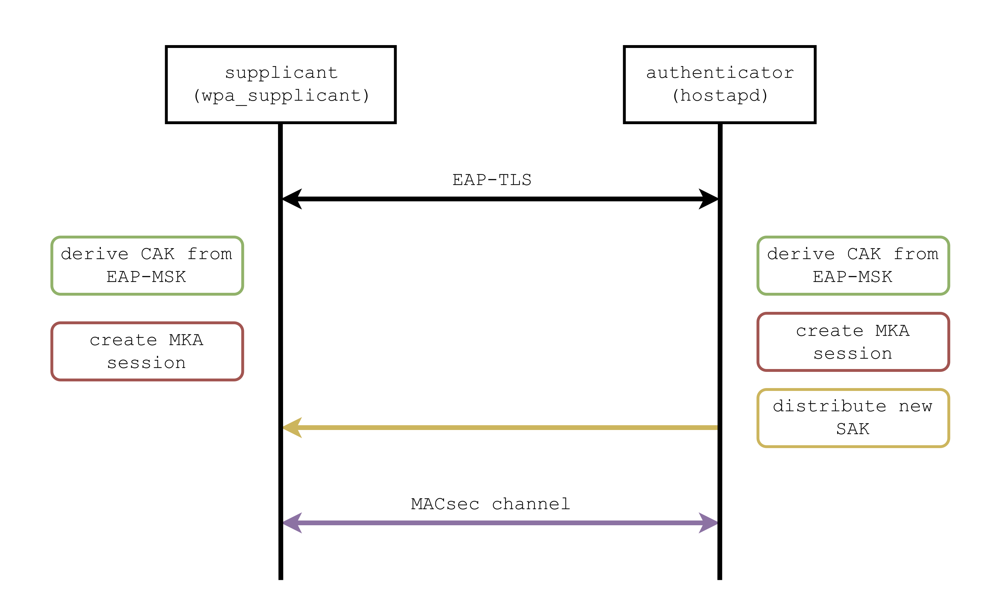

# `hostapd` and `wpa_supplicant`
This custom version of `hostapd` and `wpa_supplicant` introduces the automatic establishment of *MACsec channels* between a supplicant and an authenticator.

The overall process is integrated within a 802.1X EAP-TLS authentication:
* derivation of the Connectivity Association Key (CAK) from the EAP Master Session Key (EAP-MSK);
* creation of the MACsec Key Agreement (MKA) session;
* distribution of the Secure Association Key (SAK) from the authenticator (Key Server) to the supplicant.

<p align="center">
   
</p>

The `hostapd` daemon can also be used to manage an [Open vSwitch](http://openvswitch.org/), providing methods to automatically add/delete physical ports to/from it. This enables to use a commodity machine -- with multiple NICs -- as a MACsec-capable switch.

## Installation scripts
Two scripts are available as building tool for both `hostapd` and `wpa_supplicant`. They check all the needed dependencies and provide an interactive prompt to install them. **Beware**: they are supposed to work only on Debian/Ubuntu with Linux kernel version >= 4.8. 

If you are using Ubuntu and want to update your kernel you have to:
* download the `*.deb` files from the official [Kernel PPA of Ubuntu](http://kernel.ubuntu.com/~kernel-ppa/mainline/);
* install them by running `sudo dpkg -i *.deb`;
* reboot your machine.

Once your machine is running an updated kernel (check it by running `uname -r`), you simply have to launch both the scripts.
### `hostapd` installation script
```bash
$ ./install-hostapd.sh
```
### `wpa_supplicant` installation script
```bash
$ ./install-wpasupplicant.sh
```

## Manual installation
This version of `hostapd` and `wpa_supplicant` has been tested only on Ubuntu 16.10 LTS (Linux kernel v4.8).
### Dependencies
Latest version of [libnl](https://github.com/thom311/libnl/) is needed in order to communicate via netlink with the MACsec driver.

```bash
$ sudo apt-get install dh-autoreconf libssl-dev pkg-config bison flex

$ git clone https://github.com/thom311/libnl/

$ cd libnl
$ ./autogen.sh
$ ./configure --prefix=/opt/libnl --disable-static
$ make
$ sudo make install

$ echo "/opt/libnl/lib" | sudo tee /etc/ld.so.conf.d/libnl.conf
$ sudo ldconfig
$ export PKG_CONFIG_PATH=/opt/libnl/lib/pkgconfig
$ sudo cp /usr/src/linux-headers-$(uname -r)/include/uapi/linux/if_macsec.h /usr/include/linux/if_macsec.h
```
### Open vSwitch
[Open vSwitch](http://openvswitch.org/) is the software switch that is used as core switching engine inside each switch machine. 
It can be installed from the main project GitHub repository by following the installation [guide](https://github.com/openvswitch/ovs/blob/master/Documentation/intro/install/general.rst) or by using the package management system (on Debian/Ubuntu `sudo apt-get install openvswitch-switch`).

### Compile `hostapd` and `wpa_supplicant`
Starting from the root directory of this repository:

#### Compile `hostapd`:
```bash
$ cd hostapd
$ make
$ sudo cp hostapd /usr/local/bin/hostapd
```

#### Compile `wpa_supplicant`:
```bash
$ cd wpa_supplicant
$ make
$ sudo cp wpa_supplicant /usr/local/bin/wpa_supplicant
```

## Usage
### `hostapd` - access point
`hostapd` has to be launched on a machine that represents the access point to a network -- in our specific case, it is a switch. `hostapd` must be able to reach a RADIUS server, in order to authenticate the supplicant and create the MACsec channel by using the cryptographic material derived from the authentication. 

#### Configure `hostapd`:
`hostapd` configuration is straightforward: it needs only a configuration file with key-value pairs. A commented example can be found [here](hostapd/hostapd_macsec.conf).

#### Launch `hostapd`:
`hostapd` can be launched by passing as parameters a configuration file and the name of the Open vSwitch that has to be managed: 
```bash
$ sudo hostapd /path/to/config/file -z $ovs-bridge-name
```

Note that `hostapd` needs a running instance of [FreeRADIUS server](https://github.com/FreeRADIUS/freeradius-server) and to take advantage of the automatic generation of MACsec channels, EAP-TLS method **must** be used. FreeRADIUS also acts as DHCP server and provides some tools for the management of a Certification Authority. A guide for the installation of FreeRADIUS is available [here](https://github.com/FreeRADIUS/freeradius-server/blob/v4.0.x/INSTALL.md) or you can use the `install-freeradius.sh` script available in this repository.

### `wpa_supplicant`
`wpa_supplicant` has to be launched on a node that represents an entity that wants to join a network (i.e. supplicant). 

#### Configure `wpa_supplicant`:
Configuring `wpa_supplicant` is similar to configure `hostapd`: a configuration file is needed and an example can be found [here](wpa_supplicant/wpa_supplicant_macsec.conf).

#### Launch `wpa_supplicant`:
Even `wpa_supplicant` requires that the MACsec kernel module has been loaded.

Now `wpa_supplicant` can be launched by passing as parameters the driver to be used (-D), the network interface where it has to listen (-i), and the configuration file (-c).
```bash
$ sudo wpa_supplicant -D macsec_linux -i interface_name -c /path/to/config/file
```
